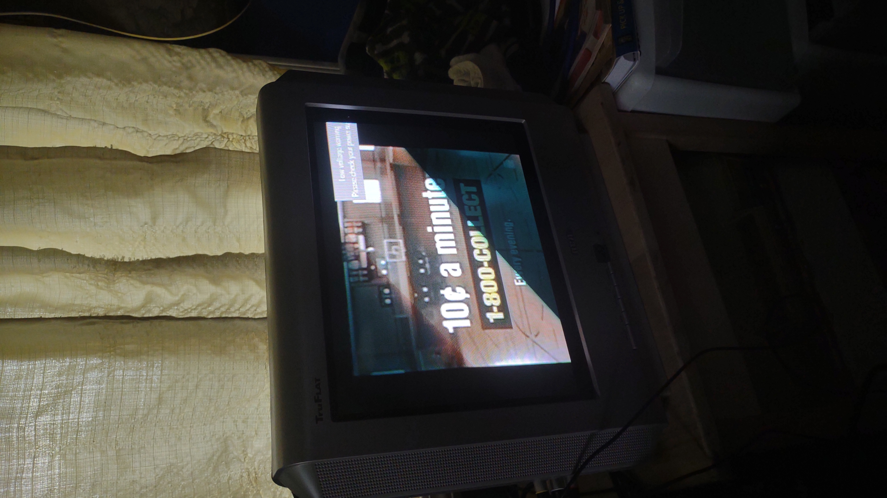

# Video Killed the Radio Star

> I heard you on the wireless back in '52
>
> Lying awake, intently tuning in on you

This sure is a project! I am currently trying to create a *thing* which automatically plays video from specific libraries.
I have a Raspberry Pi 3B strapped to an old RCA TruFlat and we're going for a spin. In a similar vein, show and movie recommendations
are welcome. 

Currently, it's just the playlist generator. Next, the world!

Confirmed working on both Raspbian and Windows. Balling.

